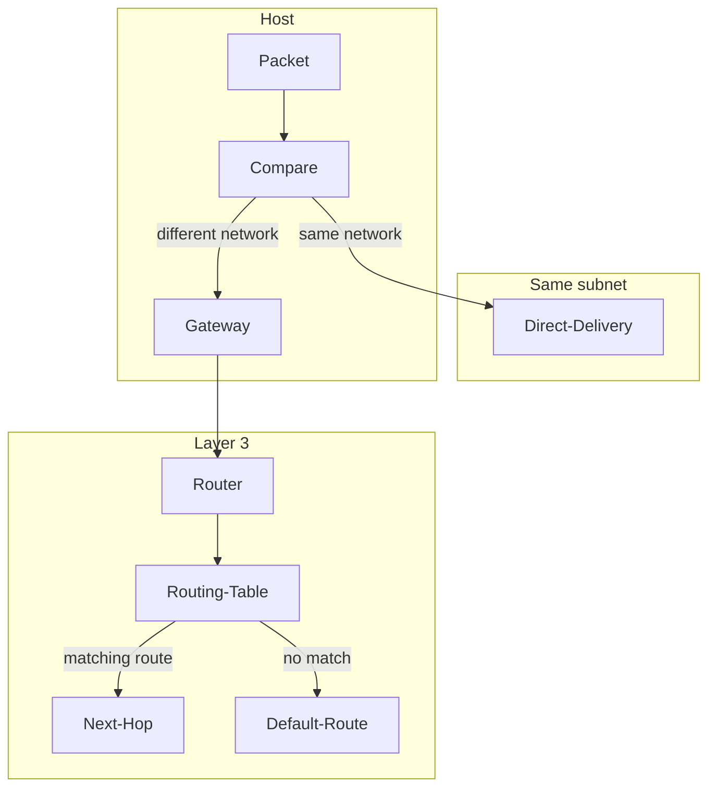

*This project has been created as part of the 42 curriculum by jtardieu*


# NetPractice
<table>
  <tr>
    <td>
      
    </td>
    <td align="center">
      <h2>GO Fix It</h2>
    </td>
	<td>
      
    </td>
  </tr>
</table>
## Description

This project aims to configure small TCP/IP networks and make every connection work.
NetPractice is a training interface of 10 levels where addresses, masks, gateways and routes are missing or wrong — the job is to fix them.

No code, no compilation. Only networking.

## 🚀 Quick Start

```
./run.sh
```

or

```
xdg-open index.html
```

## ⚙️ How to Run

| used             | for what                                        |
| ---------------- | ----------------------------------------------- |
| `run.sh`         | launch the training interface in your browser    |
| `index.html`     | the interface itself, can be opened by hand      |
| `Check` button   | validate the level once every field is filled    |
| `Export config`  | download the config file of the validated level  |

> Note
> levels are generated from a random **seed**. The topology changes at every attempt and the seed is stored inside the exported file — that is why the evaluation is done on *your* files.

## 🕹️ How to Play

| step | what you do                                                    |
| ---- | -------------------------------------------------------------- |
| 1    | pick a level                                                   |
| 2    | fill the missing IP addresses and subnet masks                 |
| 3    | set the default gateway of the hosts that need one             |
| 4    | add the routes in the routing table of the routers             |
| 5    | hit **Check** until everything is green                        |

## 📤 Export & Submission

```
# 1. click "Export config"
# 2. move the file to the root of the repo
mv ~/Downloads/<exported_file> ./level1.json
```

### the repo must look like this

```
.
├── README.md
├── level1.json
├── level2.json
├── level3.json
├── level4.json
├── level5.json
├── level6.json
├── level7.json
├── level8.json
├── level9.json
└── level10.json
```

> 10 exported configuration files, **one per level**, at the root of the repository. A missing file is a missing level.

## 🧠 How it works

### 🎭 Reading a mask

```
   192.168.1.42 / 24

   11000000.10101000.00000001.00101010   <- address
   11111111.11111111.11111111.00000000   <- mask /24
   |________ network _______||_ host __|

   network   : 192.168.1.0        (never given to a host)
   broadcast : 192.168.1.255      (never given to a host)
   hosts     : 192.168.1.1  ->  192.168.1.254
```

### 🔄 what is the principle

Where a packet goes is decided in three steps:



The principle can be summarized in four steps:
**Mask** — the host applies its mask to know its own network.
**Compare** — if the destination is in the same network, the packet is delivered directly.
**Gateway** — otherwise it is sent to the default gateway, which must be in that same network.
**Route** — the router reads its table and forwards to the next hop, or to `0.0.0.0/0` if nothing matches.

> a switch does none of this. It works at layer 2, forwards frames inside one broadcast domain, and needs no IP address at all.

## 📚 Resources

### 🧩 Concepts studied

| concept                    | what it covers                                                            |
| -------------------------- | ------------------------------------------------------------------------- |
| OSI & TCP/IP models        | layer 2 frames and MAC vs layer 3 packets and IP                          |
| IPv4 addressing            | dotted-decimal and binary, private ranges (RFC 1918)                      |
| subnet masks & CIDR        | network, broadcast, usable range, `255.255.255.0` = `/24`                 |
| default gateway            | when a host needs one, why it must sit in the same subnet                 |
| routers & routing tables   | static routes, destination/mask/next-hop, default route `0.0.0.0/0`       |
| switches                   | layer 2 forwarding, broadcast domains                                     |
| classic mistakes           | overlapping subnets, IP conflicts, network address given to a host        |

### 🔗 Links

| need               | url                                                                                   |
| ------------------ | ------------------------------------------------------------------------------------- |
| the spec itself    | [RFC 791](https://www.rfc-editor.org/rfc/rfc791) 📜                                     |
| private ranges     | [RFC 1918](https://www.rfc-editor.org/rfc/rfc1918)                                    |
| CIDR               | [RFC 4632](https://www.rfc-editor.org/rfc/rfc4632)                                    |
| the OSI model      | [cloudflare](https://www.cloudflare.com/learning/ddos/glossary/open-systems-interconnection-model-osi/) |
| subnets explained  | [cloudflare](https://www.cloudflare.com/learning/network-layer/what-is-a-subnet/)     |
| checking my maths  | [subnet calculator](https://www.subnet-calculator.com/) 🧮                              |
| all knowlege       | Kurose & Ross, *Computer Networking: A Top-Down Approach* 📖                            |
| video              | [Ben Eater](https://www.youtube.com/c/BenEater) 🎬                                      |
| explication        | my ex coworker (she's teatcher in spe network)

## 🤖 AI Usage

| tool           | task                                                                    |
| -------------- | ----------------------------------------------------------------------- |
| 🧠 **Claude** and **Gpt** | explaining masks, CIDR and gateways with counter-examples               |
| 🧠 **Claude**   | sanity-checking my reasoning on a topology before validating a level    |
| ✍️ **Claude**   | drafting and structuring this README                                    |

> no AI was used to solve the levels. Every exported configuration was computed by hand in the interface.